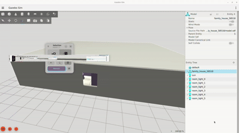

# HouseGen

A procedural house environment generator for ROS 2 robotics simulation.

HouseGen generates randomized multi-room house worlds using a Blender Python
pipeline and exports them as Gazebo Harmonic SDF scenes. Each generated world
is unique, fully collision-ready, and immediately launchable inside a
Docker-based ROS 2 Jazzy workspace.

## Objective

Testing and training robots in simulation requires diverse, realistic
environments. Hand-crafting each world is slow and limits variety.
HouseGen solves this by generating an unlimited number of structurally
different houses — varying in size, room layout, furniture placement, and
lighting — from a single command.

**Use cases:**

- **SLAM testing** — run your mapping algorithm through many different
  floor plans without manual world creation
- **Navigation training** — generate diverse obstacle layouts for
  path planning evaluation
- **Sensor simulation** — test LiDAR, depth cameras, and IMU in varied
  indoor environments
- **Dataset generation** — create large batches of labeled environments
  for machine learning pipelines

## Architecture

```
HouseGen/
├── Dockerfile                     ROS 2 Jazzy + Gazebo Harmonic image
├── docker-compose.yaml            NVIDIA GPU passthrough, ROS_DOMAIN_ID=55
├── Makefile                       make up / shell / down / world / sim
├── blender/                       HouseGen Blender pipeline
│   ├── main.py                    Runner: pick scene → generate → export
│   ├── scenes/
│   │   ├── base.py                BASE feature tree (all defaults)
│   │   ├── family_house.py        Large house, dense furniture
│   │   ├── small_apartment.py     Compact layout, no hallway
│   │   └── random_house.py        Fully random every run
│   └── modules/
│       ├── layout.py              Random floor plan generator
│       ├── walls.py               Exterior + interior walls, doors, windows
│       ├── furniture.py           Room-specific furniture catalogue
│       ├── lights.py              Ceiling point lights per room
│       ├── materials.py           Procedural Principled BSDF shaders
│       ├── house.py               Master orchestrator → HouseScene
│       └── exporter/              SDF + OBJ export for Gazebo
└── workspace/
    └── house_world/               ROS 2 package
        ├── launch/
        │   ├── sim.launch.py      Launch a generated world in Gazebo
        │   └── generate.launch.py Generate + launch in one command
        ├── worlds/                Generated SDF world files live here
        ├── config/                Bridge and parameter configs
        └── rviz/                  RViz2 config
```

## Generated Room Layout

Each house has a randomized floor plan built from these rooms:

```
┌─────────────────────────────────────┐
│                                     │
│            BEDROOM              ┌───┤
│                                 │BAT│
│                                 │   │
├───────────────┬─────────────────┴───┤
│               │                     │
│   LIVING      │      KITCHEN        │
│   ROOM        │                     │
│               │                     │
├───────────────┴─────────────────────┤
│              HALLWAY           [door]│
└─────────────────────────────────────┘
```

House dimensions, divider positions, door/window placements, and
furniture are all randomized per seed. The seed is printed at generation
time so any interesting layout can be reproduced exactly.
## Demo of the Room layout



## Quick Start

### 1 — Clone and set up

```bash
git clone https://github.com/NizarMhatli/HouseGen.git
cd HouseGen
mkdir -p build install log config
touch config/.bash_history
```

### 2 — Build the Docker image

```bash
make build
make up
make shell
```

### 3 — Build the ROS 2 package

```bash
# Inside the container
colcon build --symlink-install
source install/setup.bash
```

### 4 — Generate a house world

```bash
# On the host (requires Blender 5.x installed at /opt/blender-5.1/)
make world                        # default: family_house
make world SCENE=small_apartment  # compact apartment
make world SCENE=random_house     # fully random

# Or inside the container
ros2 launch house_world generate.launch.py scene:=family_house
```

### 5 — Launch the simulation

```bash
# In the container
ros2 launch house_world sim.launch.py

# With a specific world
ros2 launch house_world sim.launch.py world:=family_house_42731_sim

# Headless (no Gazebo GUI)
ros2 launch house_world sim.launch.py headless:=true rviz:=true
```

## Makefile Reference

| Command | Description |
|---------|-------------|
| `make build` | Build Docker image |
| `make up` | Start container (detached) |
| `make down` | Stop container |
| `make shell` | Open shell inside container |
| `make rebuild` | Full rebuild from scratch (no cache) |
| `make logs` | Follow container logs |
| `make world` | Generate default scene (family_house) |
| `make world SCENE=<name>` | Generate specific scene |
| `make sim` | Launch latest world in Gazebo |
| `make sim WORLD=<name>` | Launch specific world |
| `make rviz` | Open RViz2 |
| `make list-worlds` | List all generated worlds |
| `make ros-build` | Build ROS 2 workspace |
| `make clean` | Remove build/install/log |

## Scenes

| Scene | Size | Rooms | Furniture |
|-------|------|-------|-----------|
| `family_house` | 13–16m × 10–14m | Living, Kitchen, Bedroom, Bathroom, Hallway | Dense |
| `small_apartment` | 7–10m × 6–9m | Living, Kitchen, Bedroom, Bathroom | Normal |
| `random_house` | 10–16m × 8–14m | All rooms, random layout | Random |

## Reproducing a House

Every generation prints the seed:

```
[main] scene=family_house  seed=42731  name=FamilyHouse
```

To reproduce the same house, open `blender/scenes/family_house.py` and set:

```python
SEED = 42731
```

Then run `make world` again.

## Connecting to Other ROS 2 Nodes

HouseGen uses `ROS_DOMAIN_ID=55`. To connect from another machine or
workspace:

```bash
export ROS_DOMAIN_ID=55
export RMW_IMPLEMENTATION=rmw_fastrtps_cpp
ros2 topic list
```

## Requirements

### Host

- Ubuntu 24.04
- Docker + nvidia-container-toolkit
- NVIDIA GPU (for Gazebo Harmonic sensor rendering)
- Blender 5.x at `/opt/blender-5.1/` (for world generation)

### Docker image (auto-installed)

- ROS 2 Jazzy
- Gazebo Harmonic
- RViz2, rqt
- NVIDIA EGL passthrough

## Configuration

Edit `blender/scenes/base.py` to change global defaults:

| Section | Controls |
|---------|---------|
| `layout` | House size range, hallway, bathroom |
| `walls` | Door/window dimensions |
| `furniture` | Density (0=sparse → 2=dense) |
| `lights` | Intensity, color, attenuation |
| `materials` | Wall/floor/ceiling colors |
| `export` | Output directory, model name, world name |

## Planned Features

- [ ] Multi-storey houses
- [ ] Outdoor yard/garden area
- [ ] More room types (office, garage, laundry)
- [ ] Asset system with `.blend` mesh models (furniture beyond boxes)
- [ ] PBR texture baking from procedural shaders
- [ ] Batch generation script (generate N worlds at once)
- [ ] ROS 2 service to trigger generation from within a running simulation
- [ ] Nav2 integration — auto-generate costmaps from `house_meta.json`
